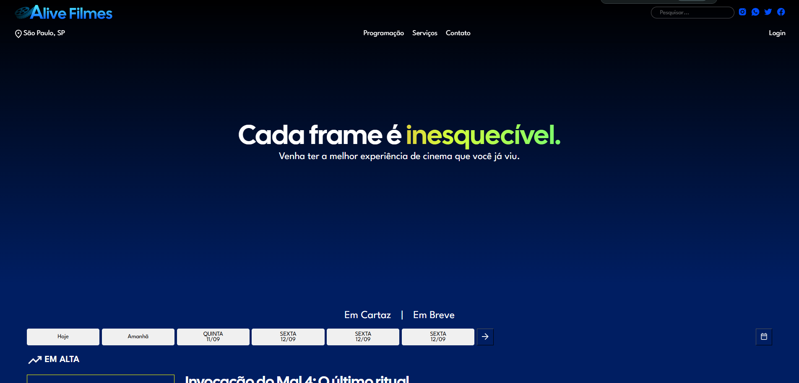
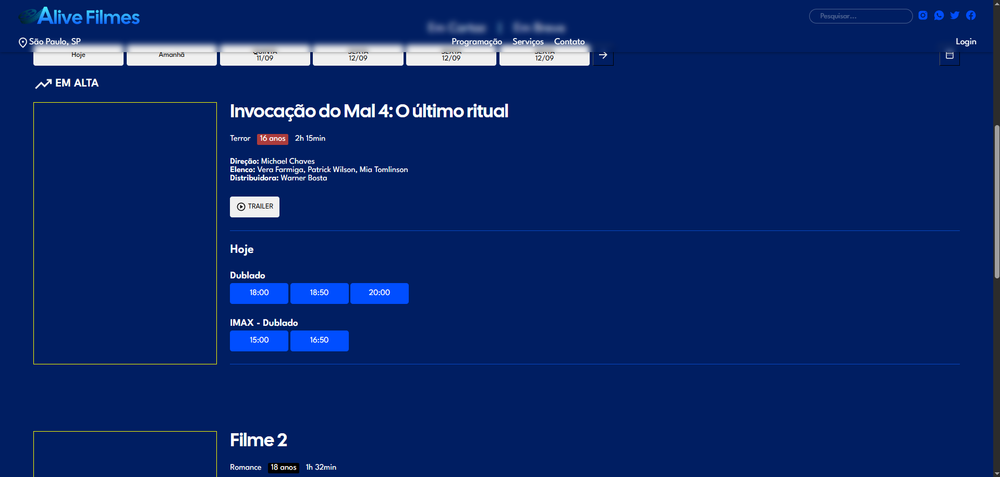

<p align="center">
  <a href="https://github.com/pondianxz/Alive-Filmes-web">
    
  </a>
</p>

<h3 align="center">
  <strong>Venha ter a melhor experiência de cinema que você já viu.</strong>
</h3>
<hr>

Esse projeto é uma **aplicação web** de uma empresa de cinema, onde você poderá comprar ingressos para o seu filme favorito, e assisti-lo em um Alive Filmes próximo de sua casa.

### 🛠 Tecnologias utilizadas:


<br>

### ⚙ Como usar
Para usar esse programa voce precisa:
- ter o XAMPP instalado, para o servidor e phpmyadmin
- Após baixar, copie a pasta e cole em ```C:\xampp\htdocs\```.
- Inicie o servidor XAMPP
- Divirta-se!

<br>

### 😱 Demonstração do sistema:


